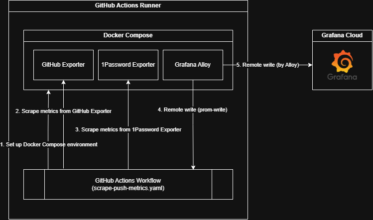

# my-stats

Experiment collecting small amount of personal metrics via GitHub Actions.

This repository is intended to test out [Grafana Alloy](https://grafana.com/docs/alloy/latest/) and [theduke/prom-write](https://github.com/theduke/prom-write) to scrape and send small amount of metrics on-demand to a remote metrics store on GitHub Actions.

## 👀 How it works

This project workflow is simple as follows:

1. Set up metrics collection environment via Docker Compose (see [docker-compose.yaml](docker-compose.yaml))
2. Scrape metrics from exporters using `curl`
3. Push metrics to Grafana Alloy via `prom-write`
4. Alloy push metrics (flush buffer on teardown) to remote metrics store via Prometheus Remote Write API

## 🔧 For your own experiment

To work with this repository for your own experiment, you need:

### 🐳 System requirements

You need to have the following tools installed on your system:

- Docker and Docker Compose

### ❄️ Tools managed via Nix Flakes

This repository uses [Nix Flakes](https://nix.dev/concepts/flakes.html) to manage tools. Following tools will be automatically installed (you need `nix` installed, of course):

- `pre-commit`
- [Grafana Alloy](https://grafana.com/docs/alloy/latest/) (`alloy`)
- [theduke/prom-write](https://github.com/theduke/prom-write) (`prom-write`)

If you prefer [Dev Container](https://containers.dev/), we have configuration ([devcontainer.json](./.devcontainer.example/devcontainer.json)) for it, with Nix installed!

### 🧪 Set up and testing

1. Copy `.env.example` to `.env` and update it with your own values.
2. Run `docker compose up --detach` to start the environment.
3. Run `nix develop` to get the tools. Do as you please.

## 📜 License

This project is licensed under the terms of the MIT license.
